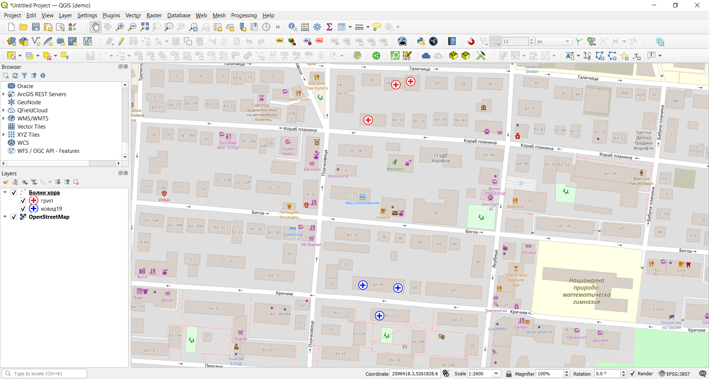
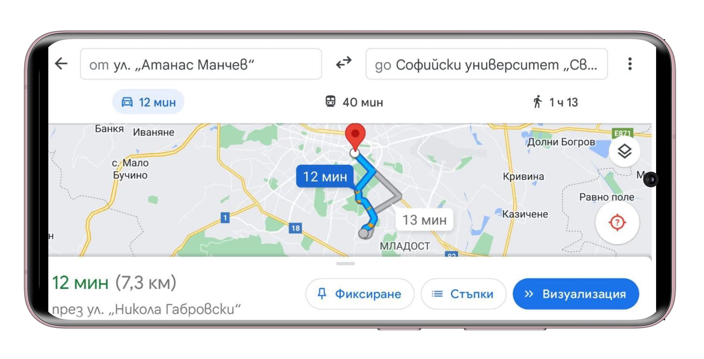
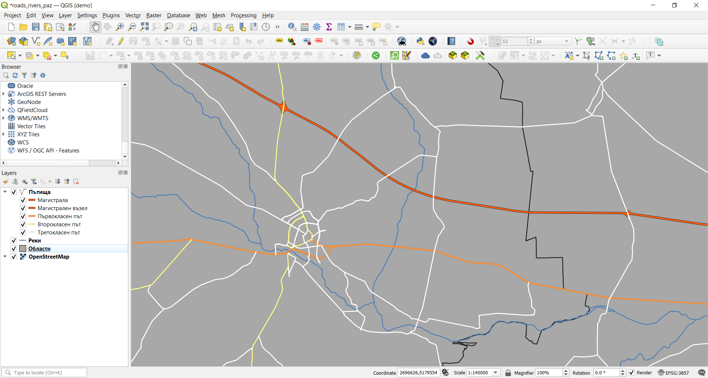
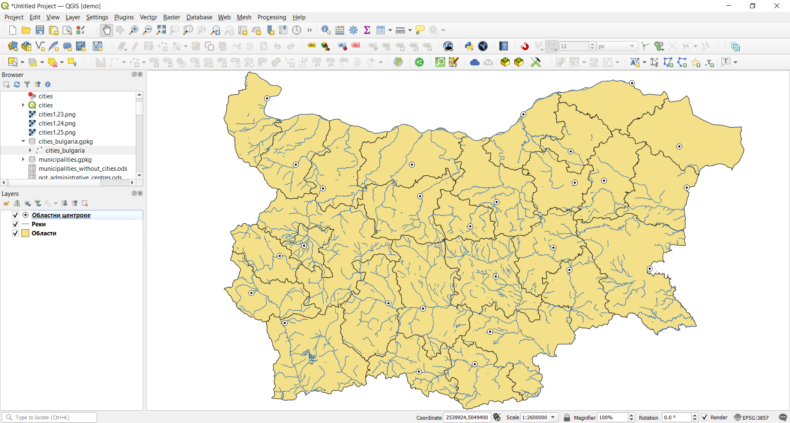
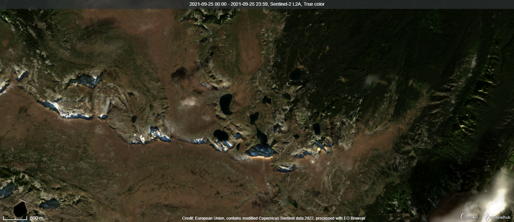
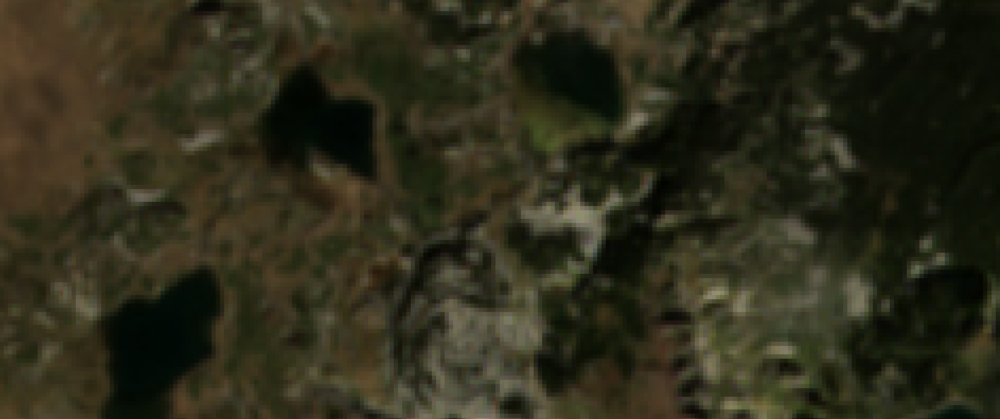

# Въведение в ГИС

## Преглед

Също както използваме специализиран софтуер за работа с електронни таблици и правим сметки с тях, така за работа с  **пространствени (географски) данни**, използваме  **ГИС приложения**. Абревиатурата ГИС означава **географски информационни системи** и се състои от три основни компонента:

- **Цифрови данни** - географската информация, която ще бъде визуализирана и анализирана с компютърен хардуер и софтуер.
- **Компютърен хардуер** - физически машини, на които се извършва обработката, визуализацията и съхранението на пространствените данни.
- **Компютърен софтуер** - компютърни програми, специализирани за работа с пространствени данни, които се изпълняват върху компютърния хардуер. Нарича се още ГИС програма или ГИС приложение.

С ГИС приложенията може да се преглеждат цифрови карти и простраствени данни, да се променят данните по начин, който да съвпада с нуждите за географски анализ, както и да се подготвят карти за печатане на хартия.

Ето полезно примерно приложение на ГИС. Това е подробен списък на пациентите на случаен общопрактикуващ лекар.

| Геогр. дължина | Геогр. ширина | Заболяване | Дата |
|----------------|---------------|--------|------|
| 23.326922      | 42.670454     | ковид19        | 2020-01-13 |
| 23.327393      | 42.670426     | ковид19        | 2020-01-18 |
| 23.327146      | 42.670151     | ковид19        | 2020-01-30 |
| 23.327561      | 42.672465     | грип           | 2020-02-08 |
| 23.327365      | 42.672554     | грип           | 2020-02-17 |
| 23.326994      | 42.672082     | грип           | 2020-02-20 |

От пръв поглед в таблицата по-горе се забелязват множество заболели от ковид19 през януари и от грип през февруари. Не толкова очевидно е обаче разпространението на нашите пациенти в пространството, освен ако не ги визуализираме в ГИС приложение.

<!-- TODO табличката по-горе, както и картинката да се приложат за някой от четирите най-големи града, като точките се струпат в определен кварта, подобно на оригиналната картинка. Да се вижда слоя на OSM отдолу с български наименования. -->
<!-- TODO LAYER gisintro.gpkg|01_patients(points|lon,lat,disease,date) -->

## Още за ГИС

С увеличаването на възможностите на компютърните системи, през 1970-те години се заражда и ГИС. В началото е наличен само за компании, университети и институти, които имат достъп до твърде скъпото компютърно оборудване и специализираните умения за работа с ГИС. В днешно време обаче вече всеки използва някакъв вид ГИС приложение на поне едно от своите устройства. Част от причините са поевтиняването и развитието на компютърната технология, експлозията от генерирани цифрови данни, както и улесняването на работата с ГИС приложения. Както вече загатнахме, ГИС включва не само компютърни програми, но и всичко, свързано със съхранението и работата с географски данни. Фокусът на това четиво е върху работата с ГИС софтуер, или по-конкретно QGIS.

## Какво е ГИС софтуер?

По-долу е приложена снимка на ГИС програма, която със сигурност е използвана от немалка част от хората по света, без дори да знаят, че това е ГИС.

<!-- TODO екранна снимка на гугъл мапс, примерно с въведен маршрут от Студентски до СУ или друго разпознаваемо. Ако е в хоризонтален режим и в рамката на мобилен телефон https://mockuphone.com, ще е прекрасно. -->

Как да докажем, че това е наистина ГИС програма?

- **визуализира географски данни** - виждаме карта все пак;
- **анализира пространствени данни** - изчислява възможни маршрути между две или няколко точки;
- **създава и променя географски данни** - може да се създават нови обекти по картата;
- **позволява бързо търсене** - търсачката на Гугъл е известна с ефективността си.

И докато Гугъл карти позволява тези и още много функционалности, основният ѝ фокус е визуализацията за крайния потребител на вече обработени географски данни от Гугъл.

За визуализацията, обработката и анализа на произволни пространствени данни има специфична група настолни приложения, която обикновено изниква в съзнанието на хората от сферата при споменаване на ГИС софтуер. Тези програми са по-сложни за работа, но и по-мощни като възможности. Настолните ГИС приложения се характеризират с графичен интерфейс, който се контролира чрез мишка и клавиатура.

При настолните ГИС програми, както и всички останали графични програми, се извършват различни **действия**, които активират дадена функцоналност. Тези действия може да са както групирани в **менюта** и **ленти с инструменти**, активирани с мишката, така и достъпни с клавишни комбинации. Всяко от тези действия отговаря за определена функционалност на ГИС програмата. Например `Add vector layer...` е действие, което активира функционалността за добавяне на нов слой.

Показването на **слоеве** с пространствени данни е основна характеристика на настолните ГИС програми. Слоевете представляват множество записи от определена категория реални обекти или явления (напр. реки, места с паднали светкавици, залесени площи и пр.). Тези записи са организирани в база данни, която най-често е в специализиран ГИС формат, за които ще стане дума в следващите глави. Такива например са `.gpkg` и `.shp` файловете.

Когато отворим слой в ГИС програмата, той ще се визуализира в **картния обзор**, който представя графично пространствените данни от заредените слоеве. При добавяне на повече от един слой, те ще започнат да се припокриват, като долните слоеве ще се скрият под тези от горните. От това свойство произлиза и името "слой". Картния обзор позволява придвижване на картата и контрол над мащаба с цел по-детайлен или по-обобщен изглед на обектите на картата.

<!-- TODO от обясненията е ясно какво трябва да имаме като картинки. -->
<!-- TODO LAYER gisintro.gpkg|obshtini(MUTLIPOLYGON|name,oblast,oblast_code,ekatte,pop_2021) // oblast_code e SOF, SFO, PLD ... -->
<!-- TODO LAYER gisintro.gpkg|railways(MULTILINE|???) // засега запазваме атрибутите както са от ОСМ -->

Друга част от графичния елемент на ГИС програмите е **списъкът със слоевете**, заредени в момента. Той наподобява легендата от хартиените карти. За разлика от хартиените карти обаче тук слоевете могат да бъдат пренареждани, скривани, показвани и групирани. Оттук може да се разбере **символогията** или начинът на изобразяване на конкретния слой. Впоследствие ще разгледаме темата със символогията по-подробно.

<!-- TODO LAYER gisintro.gpkg|rivers(MULTILINE|???) // засега запазваме атрибутите както са от ОСМ -->

## Инсталация на настолна ГИС програма

Има различни програмни продукти, които спадат към категорията настолна ГИС програма. Някои примери за такива включват:

- **QGIS** - безплатен и отворен софтуер, най-мощната и разпространена настолна ГИС програма с отворен код.
- **GRASS GIS** - безплатен и отворен софтуер, с особена популярност в академичните среди. Част от функционалността е достъпна в QGIS с приставка.
- **ArcGIS** - платен софтуер и затворен софтуер на корпорацията ESRI. Въпреки лиценза, струващ хиляди левове годишно, това е най-популярната настолна ГИС програма със затворен код.

Придобиването на лиценз за употреба на някои ГИС приложения изисква сериозна финансова инвестиция. А други се разпространяват и използват напълно безплатно завинаги. В ръководството ще използваме QGIS, който е от втория вид свободни програми, и е наличен за всяка операционна система. QGIS е софтуер в постоянна разработка на нови и нови функционалности, затова вижте как да инсталирате последната версия от официалния сайт <https://qgis.org/>.

## Запознаване с графичния интерфейс на QGIS

Въпреки че фокусът е върху QGIS, основните компоненти тук са налични и в други софтуерни продукти, при това разположени и визуализирани по подобен начин.

<!-- TODO Да се осъвремени малко -->

## ГИС данни

След като имаме представа какво е ГИС и какво може да се прави с него, време е да видим какво представляват **цифровите данни** в ГИС. В контекста на ГИС данните съдържат географски координати, с които можем да извлечем **информация** за местоположението на дадени обекти или феномени на земната повърхност. Да си припомним примера с личния лекар в началото.

Понятията **ГИС данни**, **пространствени данни** и **географски данни** са взаимнозаменяеми.

| Геогр. дължина | Геогр. ширина | Заболяване | Дата |
|----------------|---------------|--------|------|
| 23.326922      | 42.670454     | ковид19        | 2020-01-13 |

Пространствените данни тук се съхраняват в първите две колони като географска дължина и ширина. Останалите данни представляват **непространствени данни**.

Основна характеристика на ГИС е, че позволява връзката между пространствени (местоположение) и непространствени данни (описание на мястото). Всъщност в ГИС може да съхраняваме безкрайно много данни описващи мястото, една от големите разлики с печатаните карти на хартия. Например можем да добавим нови колони за всеки пациент като възраст, професия, пол, височина, националност и т.н., а след това лесно да променим визуализацията на тези данни на база възрастта, професията, пола и т. н.

В ГИС има два основни типа географски данни: **векторни** и **растерни**.

**Векторните данни** се съхраняват като поредица от точки с техните `x` и `y` координати. С векторни данни могат да се съхраняват точки, линии и полигони (площи). В следващите глави ще разгледаме векторните данни в подробности.

<!-- TODO карта на общини, общински центрове и реки -->
<!-- TODO LAYER gisintro.gpkg|rivers(MULTILINE|???) // засега запазваме атрибутите както са от ОСМ -->

**Растерните данни** са съхранени като решетка от пиксели, където всеки пискел има дадена числова стойност. Такива са всички спътникови изображения, радарни отражения, самолетни и дронни заснемания. Важна разлика между векторните и растерните данни е, че ако приближим растерните данни прекалено много, визуализацията става на квадратчета, или казано на жаргон пикселизирана. Всъщност тези пиксели представляват всяка клетка от растерната решетка. Ще обърнем специално внимание на работата с растерни данни по-нататъшна глава.

<!-- TODO може да е нещо патриотично, което изглежда яко отгоре. езерата по Рила и Пирин на първо четене? -->

## Какво научихме?

Неща обобщим какво научихме дотук:

-   **ГИС** се състои от три компонента: хардуер, софтуер и географски данни.
-   **ГИС програмите** позволяват работа с географска информация и са основна част от ГИС.
-   **Векторни** и **растерни** данни са географски данни, които се използват в ГИС програмите.
-   **Пространствена** информация може да се обвърже с **непространствена** информация.

## Практика!

Ето някои идеи за упражнения:

- Предложете поне три нови предимства на ГИС пред традиционните хартиени карти. Ето малко идеи:

    - ГИС приложенията позволяват създаването на множество различни карти с едни и същи данни.
    - ГИС са незаменими за визуализация и наблюдение на процеси (напр. ранното откриване на грипна епидемия).
    - Хартиените карти са трудни за съхранение и работа. При ГИС ограниченията за количеството данни са невероятно високи и се позволява бързо откриване на необходимото.

- Предложете възможности за извличане на информация от спътникови изображения. Ето малко идеи:

    - По време на природно бедствие спътниковите изображения могат бързо да предоставят данни за обхвата и мащабите на бедствието. Това е особено валидно при наводнения, урагани и други бедствия на огромни площи, като така могат да се координират спасителни операции.
    - Понякога хората се отнасят с недостатъчно уважение към природната среда, като изливат химикали директно в нея, което действа пагубно на живите организми в екосистемата. Със спътникови изображения такива разливи могат да бъдат следени евтино и мащабно.
    - Публичната адмиистрация може да следи за незаконни строежи и сметища.

- Обосновете няколко различни начина на подреждане на слоеве с пътища (линии), селища (полигони) и резервати (полигони).

    - Подредба отдолу нагоре в реда пътища, селища и резервати може да се използва при карта с основен фокус върху защитените територии.
    - Подредба отдолу нагоре в реда селища, резервати и пътища може да се използва при карта с основен фокус върху транспортната мрежа.

