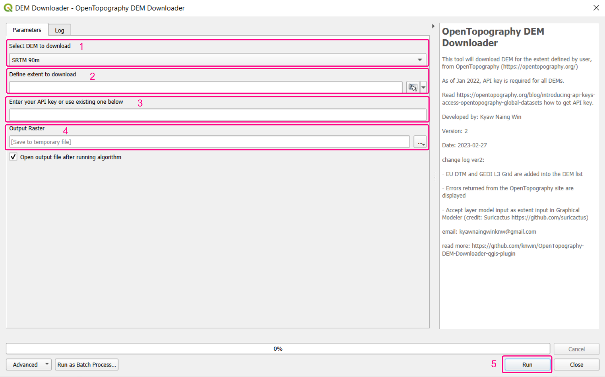
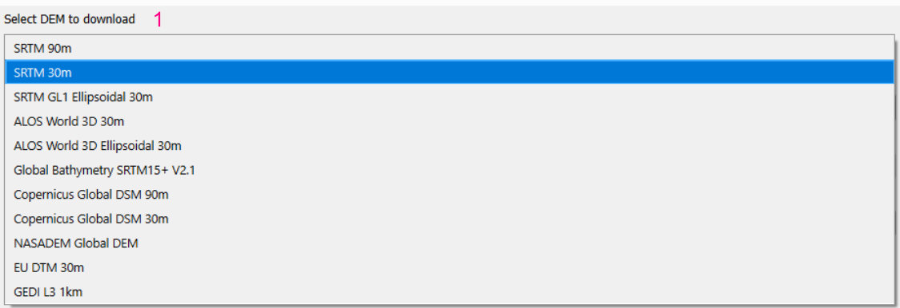
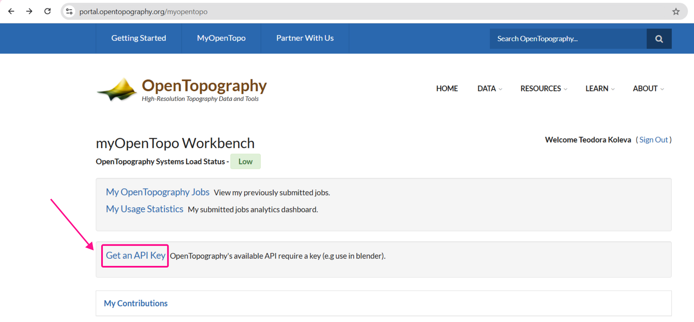

Цифровият модел на релефа (Digital elevation model или DEM) предоставя данни за надморската височина на дадена територия. Той е растерен слой, чиито пиксели съдържат информация (число) за надморската височина. OpenTopography (ОпънТопографи) е плъгин за QGIS, който позволява лесното изтегляне на цифрови модели на релефа.

## Стъпки
1. Инсталирайте OpenTopography плъгина в QGIS.
2. Създайте си регистрация на сайта на [OpenTopography](https://opentopography.org).
3. Заявете получаване на API ключ - той е уникален за всеки потребител и ще позволи изтеглянето на данни през OpenTopography.
4. Изберете услугата, чрез която ще изтегляте DEM.
5. Определете обхвата на необходимата територия.
6. Въведете API ключът ви.
7. По желание запазете изходния растер във файловата ви система или оставете да се зареди като временен слой.
8. Натиснете `Run`, за да изтеглите данните.
9. Готово!

???+ "Забележка!"
    Когато изтегляме DEM по обхват на векторен слой, е необходима допълнителна стъпка за изрязване на растера по точните граници на векторния слой (маската му) с инструмента `Clip raster by mask layer`

## Описание на диалоговия прозорец `OpenTopography`

## Заявяване на API ключ

След като сте създали регистрация в [OpenTopography](https://opentopography.org), заявете своя API ключ в секцията `MyOpenTopo`:

## Пример

Пример за изтегляне на цифров модел на релефа за община Рила и последващо изрязване по границите на общината.

<video controls width="100%">
    <source src="..img/opentopography.webm" type="video/webm">
    Sorry, your browser doesn't support embedded videos.
</video>